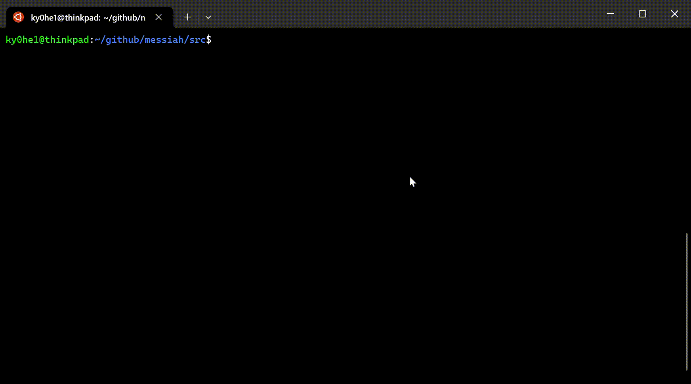

# messiah
## 紹介
低レイヤー学習の救世主「messiah」

## 概要
"自作エミュレータで学ぶx86アーキテクチャ コンピュータが動く仕組みを徹底理解！"を参考に勉強しています。

## Demo

## リンク
- [自作エミュレータで学ぶx86アーキテクチャ コンピュータが動く仕組みを徹底理解！](https://book.mynavi.jp/ec/products/detail/id=41347)